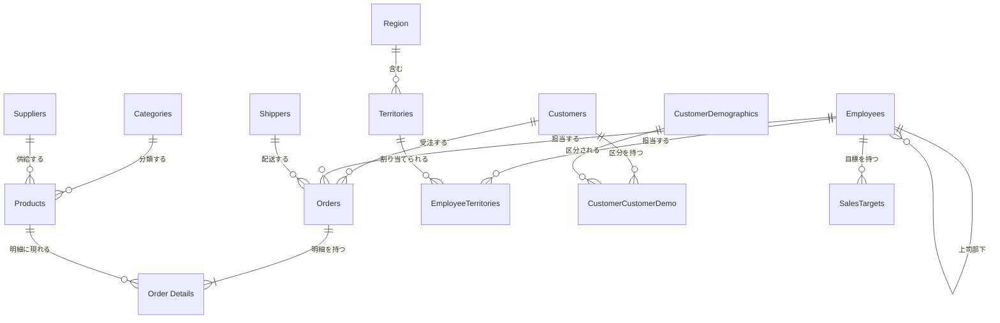

# テーブル一覧

[基本設計 Home](./Home.md) ／ [共通仕様](./Common.md) ／ [テーブル定義書](../LLD/TableSchema.md)

Northwind 原典の 13 テーブルに、パフォーマンス分析要件のための 1 テーブル（`SalesTargets`）を加えた計 14 テーブルで構成する。

## 一覧

| # | 物理名 | 論理名 | 区分 | 主キー | 主モジュール | 定義書 |
| :--- | :--- | :--- | :--- | :--- | :--- | :--- |
| 1 | `Orders` | 受注 | トランザクション | `OrderID` | 受注管理 | [Orders.md](../LLD/TableSchema/Orders.md#orders受注) |
| 2 | `Order Details` | 受注明細 | トランザクション | `OrderID`, `ProductID` | 受注管理 | [Orders.md](../LLD/TableSchema/Orders.md#order-details受注明細) |
| 3 | `Customers` | 顧客 | マスタ | `CustomerID` | 顧客管理 | [Customers.md](../LLD/TableSchema/Customers.md#customers顧客) |
| 4 | `CustomerDemographics` | 顧客区分 | マスタ | `CustomerTypeID` | 顧客管理 | [Customers.md](../LLD/TableSchema/Customers.md#customerdemographics顧客区分) |
| 5 | `CustomerCustomerDemo` | 顧客・顧客区分関連 | 関連 | `CustomerID`, `CustomerTypeID` | 顧客管理 | [Customers.md](../LLD/TableSchema/Customers.md#customercustomerdemo顧客顧客区分関連) |
| 6 | `Products` | 商品 | マスタ | `ProductID` | 商品管理 | [Products.md](../LLD/TableSchema/Products.md#products商品) |
| 7 | `Categories` | カテゴリ | マスタ | `CategoryID` | 商品管理 | [Products.md](../LLD/TableSchema/Products.md#categoriesカテゴリ) |
| 8 | `Suppliers` | 仕入先 | マスタ | `SupplierID` | 仕入先管理 | [Suppliers.md](../LLD/TableSchema/Suppliers.md#suppliers仕入先) |
| 9 | `Employees` | 社員 | マスタ | `EmployeeID` | 担当者管理 | [Employees.md](../LLD/TableSchema/Employees.md#employees社員) |
| 10 | `Region` | 地域 | マスタ | `RegionID` | 担当者管理 | [Employees.md](../LLD/TableSchema/Employees.md#region地域) |
| 11 | `Territories` | テリトリー | マスタ | `TerritoryID` | 担当者管理 | [Employees.md](../LLD/TableSchema/Employees.md#territoriesテリトリー) |
| 12 | `EmployeeTerritories` | 社員・テリトリー関連 | 関連 | `EmployeeID`, `TerritoryID` | 担当者管理 | [Employees.md](../LLD/TableSchema/Employees.md#employeeterritories社員テリトリー関連) |
| 13 | `Shippers` | 運送会社 | マスタ | `ShipperID` | 配送管理 | [Shippers.md](../LLD/TableSchema/Shippers.md#shippers運送会社) |
| 14 | `SalesTargets` | 売上目標 | トランザクション | `EmployeeID`, `TargetYear`, `TargetMonth` | パフォーマンス分析 | [Analysis.md](../LLD/TableSchema/Analysis.md#salestargets売上目標) |

`SalesTargets` のみ本設計での**追加テーブル**。他の 13 テーブルは Northwind 原典の構造を保持する（追加は楽観排他用の `RowVersion` 列のみ）。

## モジュールとテーブルの対応

「更新」はそのモジュールが登録・更新・削除を行うテーブル、「参照」は表示・検索のために読むテーブル。

| モジュール | 更新 | 参照 |
| :--- | :--- | :--- |
| 受注管理 | `Orders`, `Order Details`, `Products`（出荷時の在庫数） | `Customers`, `Employees`, `Shippers`, `Products` |
| 顧客管理 | `Customers`, `CustomerCustomerDemo` | `CustomerDemographics`, `Orders`, `Order Details` |
| 商品管理 | `Products`, `Categories` | `Suppliers`, `Order Details` |
| 仕入先管理 | `Suppliers` | `Products`, `Categories` |
| 担当者管理 | `Employees`, `EmployeeTerritories` | `Territories`, `Region`, `Orders`, `Order Details` |
| 配送管理 | `Shippers` | `Orders`, `Order Details` |
| 売上分析 | － | `Orders`, `Order Details`, `Products`, `Categories`, `Customers` |
| 在庫分析 | － | `Products`, `Categories`, `Order Details`, `Orders`, `Suppliers` |
| パフォーマンス分析 | `SalesTargets` | `Employees`, `Orders`, `Order Details`, `EmployeeTerritories`, `Territories`, `Region` |

## ER 概要

## 削除時の参照制約

いずれも `ERR-FK`（[共通仕様 7 節](./Common.md#7-共通エラーハンドリング)）で扱う。

| 削除対象 | 削除できない条件 |
| :--- | :--- |
| `Customers` | 当該顧客の `Orders` が存在する |
| `Employees` | 当該社員の `Orders` が存在する、または `ReportsTo` に当該社員を指す `Employees` が存在する |
| `Shippers` | `ShipVia` に当該運送会社を指す `Orders` が存在する |
| `Products` | 当該商品の `Order Details` が存在する |
| `Categories` | 当該カテゴリの `Products` が存在する |
| `Suppliers` | 当該仕入先の `Products` が存在する |
| `Orders` | なし（明細を先に削除したうえで削除する） |

`CustomerCustomerDemo` と `EmployeeTerritories` は関連テーブルであり、親の削除時にあわせて削除する。
