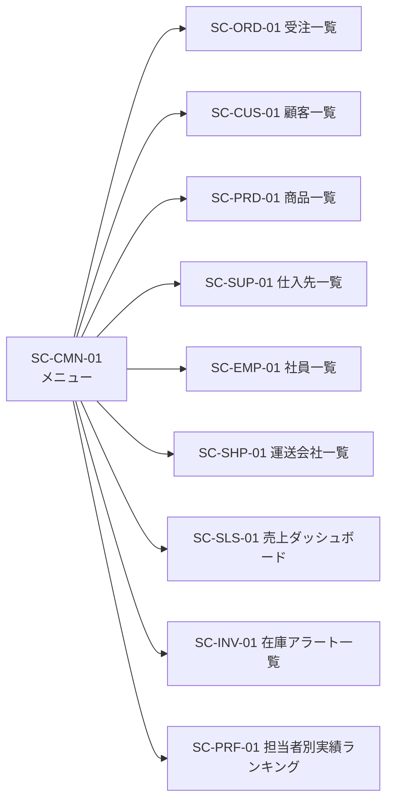
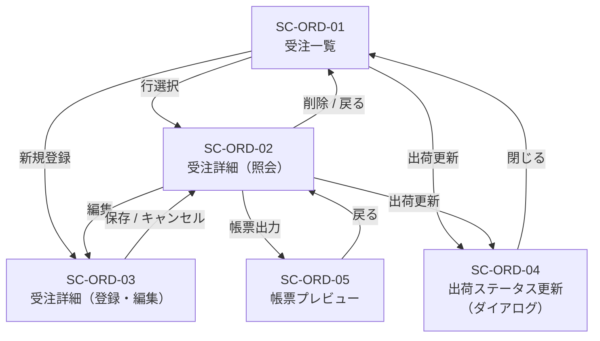
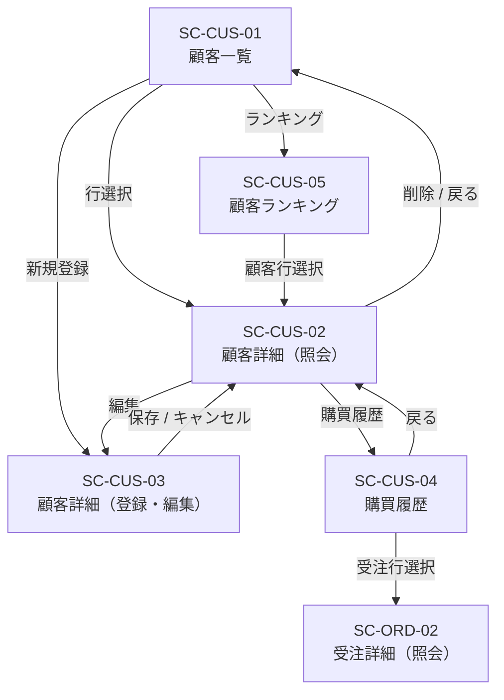
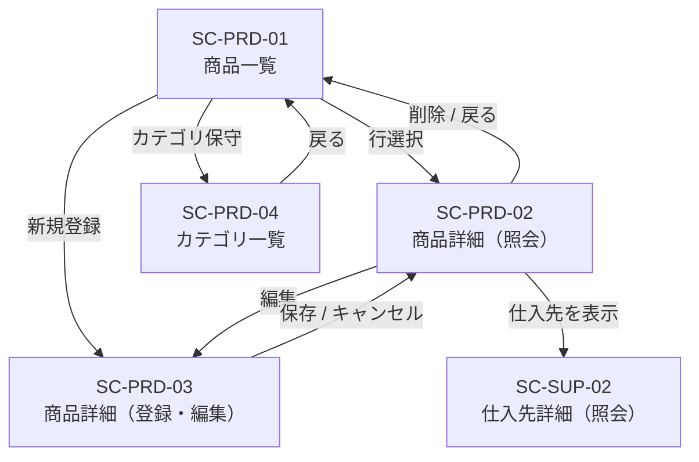
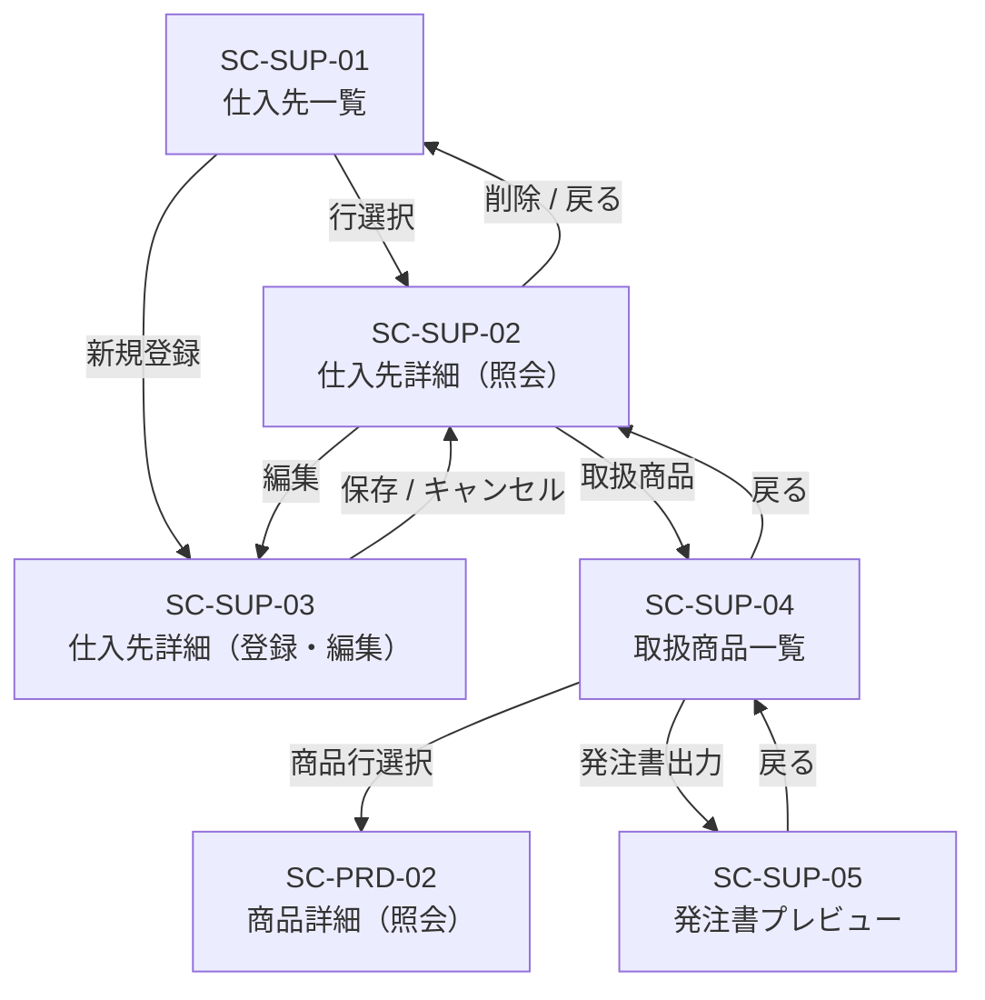
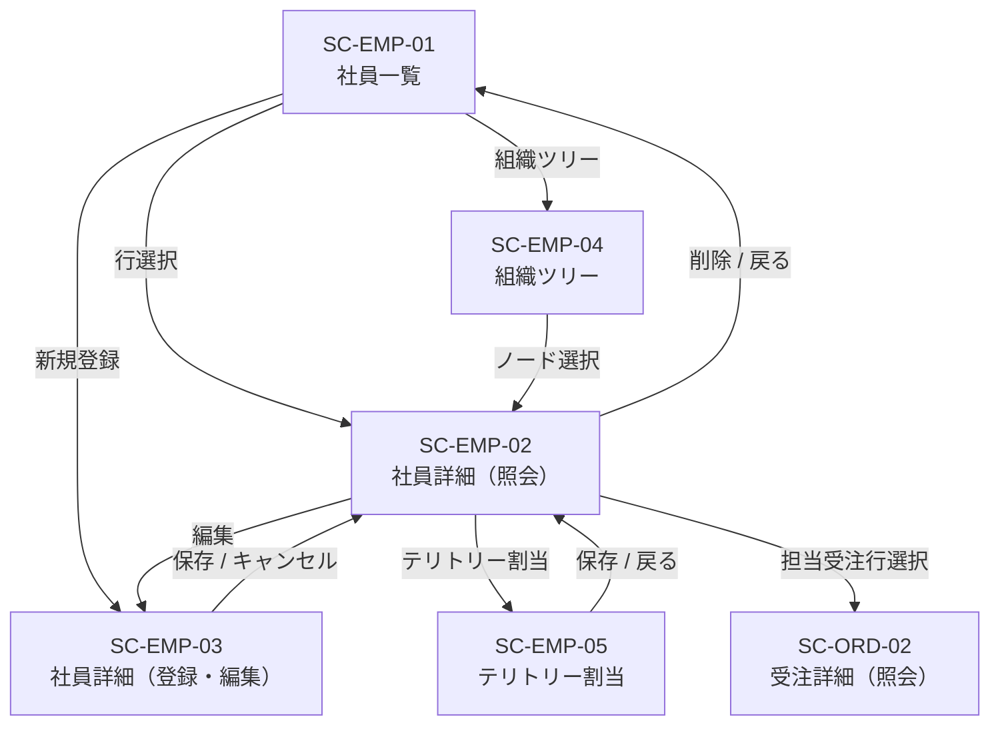
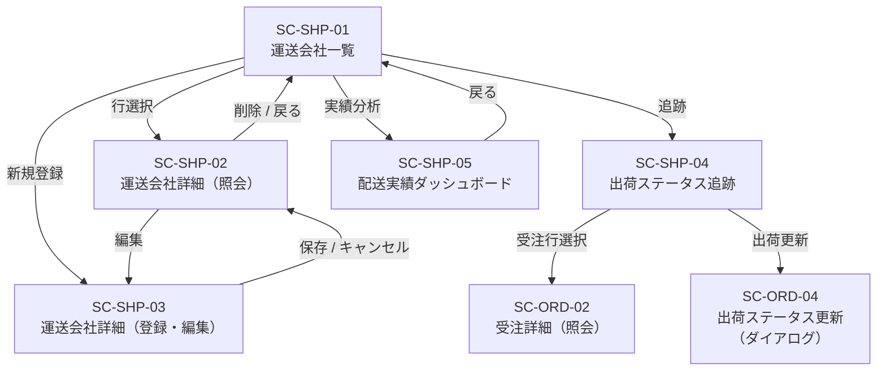
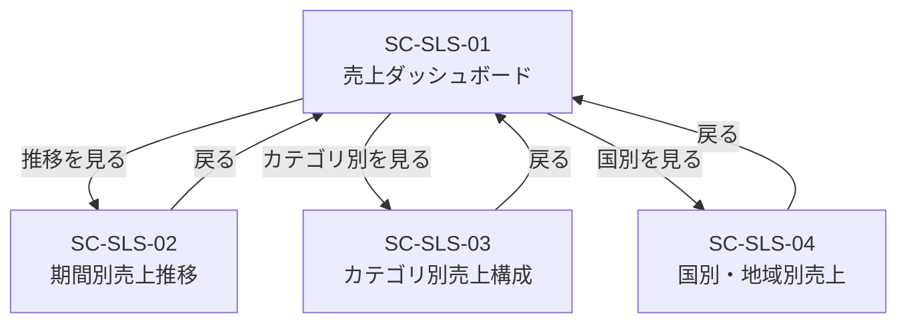
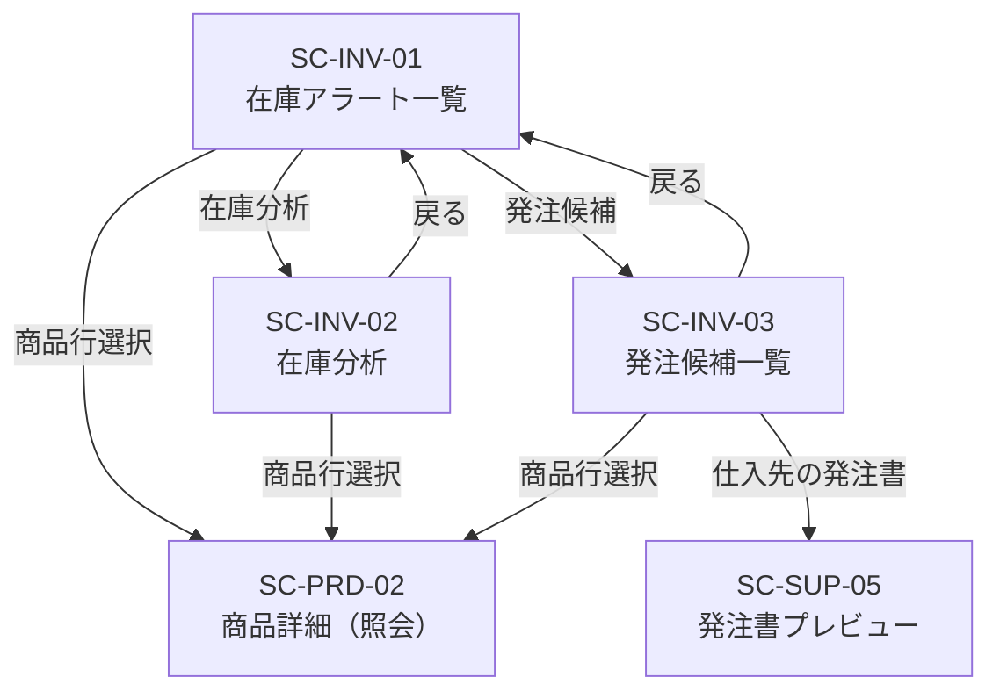
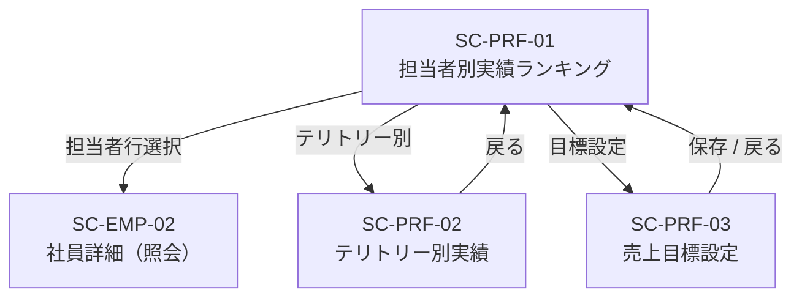

# 画面遷移

[基本設計 Home](./Home.md) ／ [共通仕様](./Common.md) ／ [画面一覧](./UI_List.md)

モジュールごとに遷移図と遷移表を示す。遷移表は「遷移元 / 遷移先 / 契機 / 引き渡しパラメータ / 戻り時の挙動」で構成する。

## 共通の遷移ルール

| # | ルール |
| :--- | :--- |
| F-1 | すべての画面からヘッダのメニューリンクでメニュー画面（`SC-CMN-01`）へ遷移できる（[共通仕様 8 節](./Common.md#8-共通イベント)）。以降の遷移表では省略する |
| F-2 | 一覧画面から詳細画面へ遷移し戻った際は、直前の検索条件・ページ・並び順を復元する |
| F-3 | 登録・編集モードで未保存の変更がある状態の離脱操作は、確認ダイアログを挟む |
| F-4 | 遷移パラメータで指定されたキーのデータが存在しない場合は `ERR-NOTFOUND` とし、当該モジュールの一覧画面へ遷移する |
| F-5 | ダイアログは元画面の上に重ねて表示し、閉じたときは元画面へ戻って一覧を再読み込みする |

---

## 全体（メニューからの入口）

| 遷移元 | 遷移先 | 契機 | 引き渡しパラメータ |
| :--- | :--- | :--- | :--- |
| `SC-CMN-01` | 各モジュールの先頭画面 | メニュー項目の選択 | なし |

---

## 受注管理（`ORD`）

| 遷移元 | 遷移先 | 契機 | 引き渡しパラメータ | 戻り時の挙動 |
| :--- | :--- | :--- | :--- | :--- |
| `SC-ORD-01` | `SC-ORD-02` | 一覧の行を選択 | 受注 ID | F-2 に従い一覧状態を復元 |
| `SC-ORD-01` | `SC-ORD-03` | 「新規登録」を選択 | なし（登録モード） | 保存後は登録された受注の `SC-ORD-02` へ |
| `SC-ORD-01` | `SC-ORD-04` | 一覧行の「出荷更新」を選択 | 受注 ID | 閉じた後に一覧を再読み込み |
| `SC-ORD-02` | `SC-ORD-03` | 「編集」を選択 | 受注 ID（編集モード） | 出荷済の受注では「編集」を非活性（ORD-T4） |
| `SC-ORD-02` | `SC-ORD-04` | 「出荷更新」を選択 | 受注 ID | 閉じた後に詳細を再読み込み |
| `SC-ORD-02` | `SC-ORD-05` | 「納品書」「請求書」を選択 | 受注 ID、帳票種別 | － |
| `SC-ORD-02` | `SC-ORD-01` | 「一覧へ戻る」／削除の完了 | なし | 削除時は一覧を再読み込み |
| `SC-ORD-03` | `SC-ORD-02` | 保存の完了／「キャンセル」 | 受注 ID | キャンセルは F-3 の確認を挟む。登録モードのキャンセルは `SC-ORD-01` へ |
| `SC-ORD-04` | 呼び出し元 | 「更新」の完了／「閉じる」 | なし | F-5 に従い呼び出し元を再読み込み |
| `SC-ORD-05` | `SC-ORD-02` | 「戻る」 | 受注 ID | － |

---

## 顧客管理（`CUS`）

| 遷移元 | 遷移先 | 契機 | 引き渡しパラメータ | 戻り時の挙動 |
| :--- | :--- | :--- | :--- | :--- |
| `SC-CUS-01` | `SC-CUS-02` | 一覧の行を選択 | 顧客 ID | F-2 に従い一覧状態を復元 |
| `SC-CUS-01` | `SC-CUS-03` | 「新規登録」を選択 | なし（登録モード） | － |
| `SC-CUS-01` | `SC-CUS-05` | 「顧客ランキング」を選択 | なし | － |
| `SC-CUS-02` | `SC-CUS-03` | 「編集」を選択 | 顧客 ID（編集モード） | 顧客 ID は読み取り専用（CUS-T2） |
| `SC-CUS-02` | `SC-CUS-04` | 「購買履歴」を選択 | 顧客 ID | － |
| `SC-CUS-02` | `SC-CUS-01` | 「一覧へ戻る」／削除の完了 | なし | － |
| `SC-CUS-03` | `SC-CUS-02` | 保存の完了／「キャンセル」 | 顧客 ID | 登録モードのキャンセルは `SC-CUS-01` へ |
| `SC-CUS-04` | `SC-ORD-02` | 受注一覧の行を選択 | 受注 ID | 戻り先は `SC-CUS-04` |
| `SC-CUS-05` | `SC-CUS-02` | ランキングの行を選択 | 顧客 ID | 戻り先は `SC-CUS-05` |

---

## 商品管理（`PRD`）

| 遷移元 | 遷移先 | 契機 | 引き渡しパラメータ | 戻り時の挙動 |
| :--- | :--- | :--- | :--- | :--- |
| `SC-PRD-01` | `SC-PRD-02` | 一覧の行を選択 | 商品 ID | F-2 に従い一覧状態を復元 |
| `SC-PRD-01` | `SC-PRD-03` | 「新規登録」を選択 | なし（登録モード） | － |
| `SC-PRD-01` | `SC-PRD-04` | 「カテゴリ保守」を選択 | なし | － |
| `SC-PRD-02` | `SC-PRD-03` | 「編集」を選択 | 商品 ID（編集モード） | － |
| `SC-PRD-02` | `SC-SUP-02` | 仕入先名を選択 | 仕入先 ID | 戻り先は `SC-PRD-02` |
| `SC-PRD-02` | `SC-PRD-01` | 「一覧へ戻る」／削除の完了 | なし | － |
| `SC-PRD-03` | `SC-PRD-02` | 保存の完了／「キャンセル」 | 商品 ID | 登録モードのキャンセルは `SC-PRD-01` へ |
| `SC-PRD-04` | `SC-PRD-01` | 「戻る」 | なし | カテゴリ一覧内で行単位の登録・編集・削除を完結させる |

---

## 仕入先管理（`SUP`）

| 遷移元 | 遷移先 | 契機 | 引き渡しパラメータ | 戻り時の挙動 |
| :--- | :--- | :--- | :--- | :--- |
| `SC-SUP-01` | `SC-SUP-02` | 一覧の行を選択 | 仕入先 ID | F-2 に従い一覧状態を復元 |
| `SC-SUP-01` | `SC-SUP-03` | 「新規登録」を選択 | なし（登録モード） | － |
| `SC-SUP-02` | `SC-SUP-03` | 「編集」を選択 | 仕入先 ID（編集モード） | － |
| `SC-SUP-02` | `SC-SUP-04` | 「取扱商品」を選択 | 仕入先 ID | － |
| `SC-SUP-02` | `SC-SUP-01` | 「一覧へ戻る」／削除の完了 | なし | － |
| `SC-SUP-03` | `SC-SUP-02` | 保存の完了／「キャンセル」 | 仕入先 ID | 登録モードのキャンセルは `SC-SUP-01` へ |
| `SC-SUP-04` | `SC-PRD-02` | 商品一覧の行を選択 | 商品 ID | 戻り先は `SC-SUP-04` |
| `SC-SUP-04` | `SC-SUP-05` | 「発注書出力」を選択 | 仕入先 ID | 発注候補が 0 件のときは非活性 |
| `SC-SUP-05` | `SC-SUP-04` | 「戻る」 | 仕入先 ID | － |

---

## 担当者管理（`EMP`）

| 遷移元 | 遷移先 | 契機 | 引き渡しパラメータ | 戻り時の挙動 |
| :--- | :--- | :--- | :--- | :--- |
| `SC-EMP-01` | `SC-EMP-02` | 一覧の行を選択 | 社員 ID | F-2 に従い一覧状態を復元 |
| `SC-EMP-01` | `SC-EMP-03` | 「新規登録」を選択 | なし（登録モード） | － |
| `SC-EMP-01` | `SC-EMP-04` | 「組織ツリー」を選択 | なし | － |
| `SC-EMP-02` | `SC-EMP-03` | 「編集」を選択 | 社員 ID（編集モード） | － |
| `SC-EMP-02` | `SC-EMP-05` | 「テリトリー割当」を選択 | 社員 ID | － |
| `SC-EMP-02` | `SC-ORD-02` | 担当受注一覧の行を選択 | 受注 ID | 戻り先は `SC-EMP-02` |
| `SC-EMP-02` | `SC-EMP-01` | 「一覧へ戻る」／削除の完了 | なし | － |
| `SC-EMP-03` | `SC-EMP-02` | 保存の完了／「キャンセル」 | 社員 ID | 登録モードのキャンセルは `SC-EMP-01` へ |
| `SC-EMP-04` | `SC-EMP-02` | ツリーのノードを選択 | 社員 ID | 戻り先は `SC-EMP-04` |
| `SC-EMP-05` | `SC-EMP-02` | 保存の完了／「戻る」 | 社員 ID | F-3 の確認を挟む |

---

## 配送管理（`SHP`）

| 遷移元 | 遷移先 | 契機 | 引き渡しパラメータ | 戻り時の挙動 |
| :--- | :--- | :--- | :--- | :--- |
| `SC-SHP-01` | `SC-SHP-02` | 一覧の行を選択 | 運送会社 ID | － |
| `SC-SHP-01` | `SC-SHP-03` | 「新規登録」を選択 | なし（登録モード） | － |
| `SC-SHP-01` | `SC-SHP-04` | 「出荷追跡」を選択 | なし | － |
| `SC-SHP-01` | `SC-SHP-05` | 「実績分析」を選択 | なし | － |
| `SC-SHP-02` | `SC-SHP-03` | 「編集」を選択 | 運送会社 ID（編集モード） | － |
| `SC-SHP-02` | `SC-SHP-01` | 「一覧へ戻る」／削除の完了 | なし | － |
| `SC-SHP-03` | `SC-SHP-02` | 保存の完了／「キャンセル」 | 運送会社 ID | 登録モードのキャンセルは `SC-SHP-01` へ |
| `SC-SHP-04` | `SC-ORD-02` | 受注一覧の行を選択 | 受注 ID | 戻り先は `SC-SHP-04` |
| `SC-SHP-04` | `SC-ORD-04` | 一覧行の「出荷更新」を選択 | 受注 ID | 閉じた後に追跡一覧を再読み込み |
| `SC-SHP-05` | `SC-SHP-01` | 「戻る」 | なし | － |

---

## 売上分析（`SLS`）

| 遷移元 | 遷移先 | 契機 | 引き渡しパラメータ | 戻り時の挙動 |
| :--- | :--- | :--- | :--- | :--- |
| `SC-SLS-01` | `SC-SLS-02` / `SC-SLS-03` / `SC-SLS-04` | 各分析へのリンクを選択 | 指定中の集計期間 | 戻り時も期間を保持する |
| `SC-SLS-02` / `SC-SLS-03` / `SC-SLS-04` | `SC-SLS-01` | 「戻る」 | 指定中の集計期間 | － |

---

## 在庫分析（`INV`）

| 遷移元 | 遷移先 | 契機 | 引き渡しパラメータ | 戻り時の挙動 |
| :--- | :--- | :--- | :--- | :--- |
| `SC-INV-01` | `SC-PRD-02` | 一覧の行を選択 | 商品 ID | 戻り先は `SC-INV-01` |
| `SC-INV-01` | `SC-INV-02` / `SC-INV-03` | 各分析へのリンクを選択 | なし | － |
| `SC-INV-02` | `SC-PRD-02` | 一覧の行を選択 | 商品 ID | 戻り先は `SC-INV-02` |
| `SC-INV-03` | `SC-SUP-05` | 仕入先単位の「発注書」を選択 | 仕入先 ID | 戻り先は `SC-INV-03` |
| `SC-INV-02` / `SC-INV-03` | `SC-INV-01` | 「戻る」 | なし | － |

---

## パフォーマンス分析（`PRF`）

| 遷移元 | 遷移先 | 契機 | 引き渡しパラメータ | 戻り時の挙動 |
| :--- | :--- | :--- | :--- | :--- |
| `SC-PRF-01` | `SC-EMP-02` | ランキングの行を選択 | 社員 ID | 戻り先は `SC-PRF-01` |
| `SC-PRF-01` | `SC-PRF-02` | 「テリトリー別」を選択 | 指定中の集計期間 | － |
| `SC-PRF-01` | `SC-PRF-03` | 「目標設定」を選択 | 指定中の対象年 | － |
| `SC-PRF-02` | `SC-PRF-01` | 「戻る」 | 指定中の集計期間 | － |
| `SC-PRF-03` | `SC-PRF-01` | 保存の完了／「戻る」 | なし | F-3 の確認を挟む。戻り時にランキングを再集計する |
